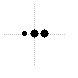
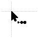
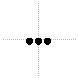
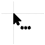
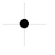
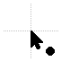
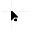
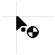
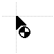
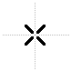

### 3.7.0

Added three new loading animation styles for the `busy` and `working` cursors, as an alternative to the original rotating wheel. They avoid rotation entirely, which reads better at small sizes and in 1-bit black and white:
- `pulse` — three dots swelling one after another    
- `bounce` — three dots hopping in sequence    
- `ripple` — a ring expanding outwards from a steady centre dot    

Every loading style is also built for the "no tail" and "tail detached" arrows, named `working[_arrow_style]_[animation].ani` (for example `working_no_tail_pulse.ani`). The `busy` cursor has no arrow in it, so it is simply `busy_pulse.ani`, `busy_bounce.ani` or `busy_ripple.ani`.

Other changes:
- Added an `.inf` installer for every combination of arrow style and loading animation (12 in total). Each one installs into its own folder under `C:\Windows\Cursors` and registers a separate scheme name, so several of them can be installed and compared side by side
- Moved all cursors and installers into the `src` folder
- Updated the README: new banner, showcase table now lists `arrow_no_tail_smaller`, and the install instructions point to the "Code" > "Download ZIP" button

### 3.6.1
- Removed the assymetric corner pixel in regular arrow cursors (`arrow`, `help` and `working`)
- Fixed some visual inconsitencies in the `working_tail_detached` cursor
- Renamed some cursors for better clarity: 
    -- `vertical_line` to `vertical_v2`
    -- `horizontal_line` to `horizontal_v2`
    -- `move_alt` to `move_v2`

### 3.6.0

Added new "tail detached" cursors (design proposed by **_aicraglednay**): 
- `arrow_tail_detached`   
- `working_tail_detached`   
- `working_tail_detached_v2`   

Added another new cursor:  
- `unavailable_v3`   

New table with all available cursors is available in the [Showcase](https://github.com/emvaized/modern_inverted_mouse_cursors?tab=readme-ov-file#showcase)!

### 3.5
- Added new fancy loading cursors (`busy` and 2 `working` variants) — only 32px versions for now. Original loading cursors (with clock) moved to the "old" folder
- All cursors were converted to 1-bit color depth for better compatibility with apps. They also weight much less now (~2kbs instead of ~22kbs per cursor)
- Updated `beam` cursor for slightly sharper tips
- Updated `unavailable_v2` cursor — it's now centered and a little bit bolder
- All move/resize cursors received slightly rounded tips
- Removed original `link` cursor — `link_v2` now became the new `link`, and `link_v3` became `link_v2`
- Swapped `diagonal_1` and `diagonal_2` cursors to be consistent with their naming in the Control panel

### 3.0
- Added new cursors:
    -- `unavailable_v2` (default now)
    -- `pen`
    -- `special`
    -- `help_no_tail`
    -- `link_v3` with sharper bottom-right corner (default in "no-tail" theme)

- Updated `beam` cursor for slightly sharper tips
- Updated `move` and all "resize" cursors to have consistent center dot size
- Renamed "no_tail" to "no_tail_smaller", and "no_tail_v2" cursors to just "no_tail" (default in "no-tail" theme)
- Added 2 `install.inf` installers (for regular and no-tail themes)

### 2.0
- `busy` cursor now has slightly bolder outline in smaller sizes
- added `link_v2` cursor - it has a slightly more refined shape and no finger lines on top
- `arrow_no_tail_bigger` replaced with `arrow_no_tail_v2`. It has slightly more rounded corners and bolder outline compared to regular cursor 

### 1.0
Initial release
